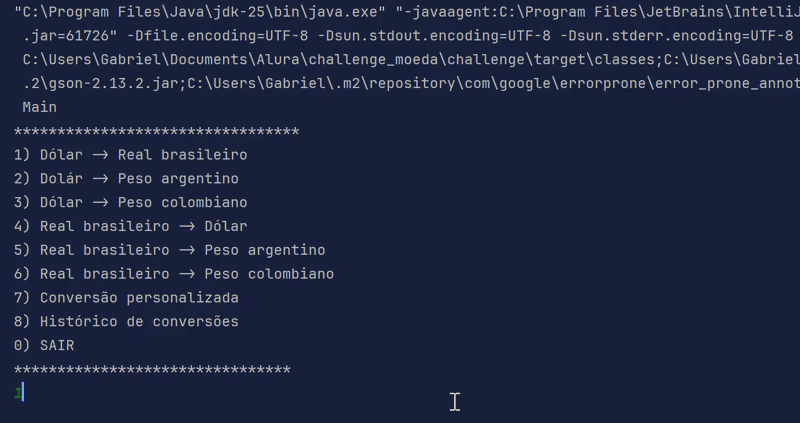

# Convesor de Moedas

---

CLI de convesor de moedas que utiliza a API do [exchange rate](https://www.exchangerate-api.com/) para
pegar a taxa de conversão.

---

---
## Moedas disponíveis

As moedas disponíveis são as mesmas da API e seguem o formato [ISO 4217](https://pt.wikipedia.org/wiki/ISO_4217)
- Lista de moedas: https://www.exchangerate-api.com/docs/supported-currencies

---

## Pré-requisito
1. Ter chave API: https://v6.exchangerate-api.com
2. Adicionar sua chave API  a variável de ambiente:
   - **API_KEY**={SUA_CHAVE}
